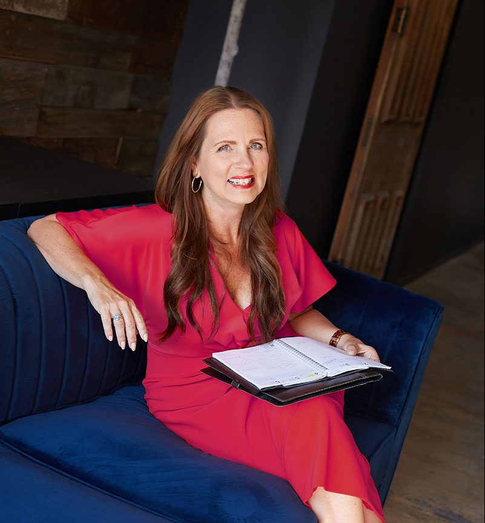
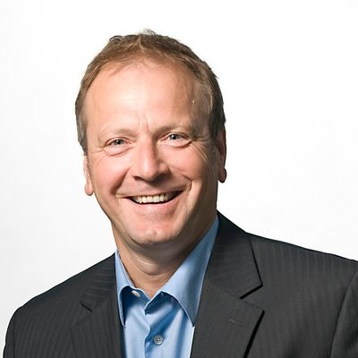

#### What People Say About Mark

## Testimonials

In a 2nd marriage with seven children between us, we wanted solid advice and tested principles we could use to transform our own relationship when it was on the brink of hopeless disaster! Somehow Mark’s advice and stories cut through the rhetoric and gave us both insights to build a new life on. We loved each other; we just didn’t know about how important it was to have a blueprint to keep us working on our relationship intentionally! Highly recommend, it has improved our lives and love! Sue StylesC.E.O. The Successful Solopreneurs School of Business Author, Business Coach, Professional Speaker The Successful Solopreneurs Podcast Host  “Mark has a remarkable capacity to connect with people. His skill as a Coach is exemplary. He is able to see through surface issues, and speak to the hear, seeing and providing wisdom that brings understanding, and steps to achieve what is desired and needed.” Jack TothFounder/V.P. External and Community Relations at Impact Society.  At his core -- Mark Gordon is a people person - and out of his heart for people, comes a desire to see people in healthy and meaningful relationships. If you are looking for a relationship coach - whether personally or professionally, I know that Marks skills and insights will provide you will tools to strengthens your relationships. Wes MillsPresident at Apostolic Church of Pentecost of Canada 
