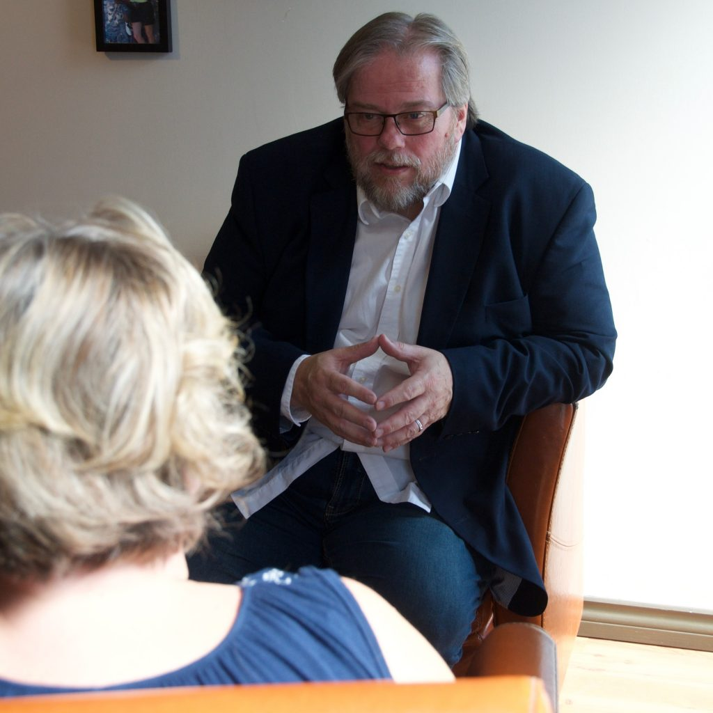

## Relationship & Leadership Coaching

If you find your family or organization in a relational crisis. I will help you get to the root of the issue so healing can begin. Then I'll walks with you in the journey to wholeness in your relationship.

Coaching is a journey I am invited on, walking with you in healing the relationship from the inside out. The process I take you on includes asking questions to dig into the foundations of the relationship and drawing answers out, you already have in your heart, but are unaware of. Then together, we build a game plan to create a flourishing relationship. Relationships can be complex and at times everyone needs help seeing the path to making them strong.

## My Approach is Three-Fold:

**I coach** by helping you unearth the cause and effect and how it is impacting your relationships. I rely on God's Spirit to lead me in asking the right questions that reveal the roots so we can bring them to Jesus for healing. If the roots are not dealt with you will continue going in circles.

**I teach** principles that help you create a healthy relational culture in your relationships, including 5 pillars of a healthy foundation. (From my book and video series) you don’t know what you don’t know so this training has proven to be very effective because awareness gives you choice and empowers you to make the right choices.

**Soul Care** - this is walking with you in the journey of restoring your relationship with God, yourself and others. (Also known as discipleship) This is ongoing care and investment to ensure long term success. Relapse into old patterns is a real possibility when people become comfortable in the new game plan. You stop doing the things you did to restore your relationship, I have found ongoing care helps keep the plan on track.

## Coaching Options

- Relationship Renovation Plan
- Executive & Leadership Coaching Plan
- Individual Life Coaching

- Parenting Coaching
- Family Legacy Coaching (Wealth Transfer)

## Premium Coaching Packages

Due to my detail and through approach it takes time which is why I do not provide one-off coaching. If you want to see if we can be a good fit, I do provide a complimentary 15-minute discovery call to discuss our potential journey together. 

[Book Discovery Call](https://meetings.hubspot.com/rmarkgordon/15-min-discovery-meeting) 

#### What people say?

"Worked with Mark a year ago. He is a caring, and knowledgeable relationship coach that operates with his clients best interest in view." - Bruce White "Thank you for literally saving our marriage and helping us heal from the inside out, we felt safe and never felt judged even when we were creating our own craziness. There not enough words to express our gratitude" - Jamie & Kayleen "In a 2nd marriage with seven children between us, we wanted solid advice and tested principles we could use to transform our own relationship when it was on the brink of hopeless disaster! Somehow Mark’s advice and stories cut through the rhetoric and gave us both insight to build a new life on. We loved each other, we just didn’t know about how important those pillars were! Highly recommend him as a speaker and his book, it has improved our lives and love!" - Sue Styles Business Consultant for Solopreneurs / Entrepreneurs, Speaker & Author
