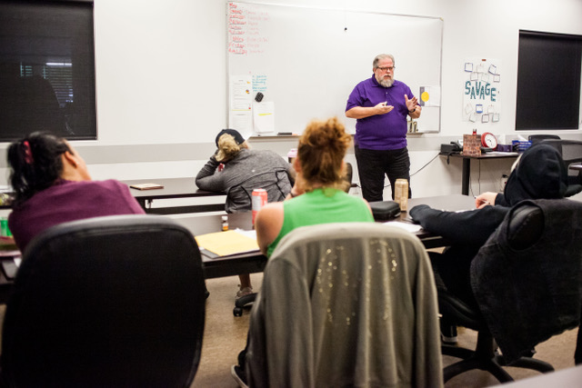

   

# Faith Community Packages

## Choose the plan that’s right for you.

Over the past 30 years I have developed principal-based systems and practical blueprints that foster healthy relationships, solving the relationship gap we have today. 

Church families flourish most when there is a healthy relational culture and so I offer a variety of plans for faith communities that serves all three area's of church relationships. 

- The congregation’s family and personal relationships
- The Leadership teams relationships
- The Pastors relationships

I work with all three at the same time helping you develop a healthy relational culture and flourishing church

[BOOK DISCOVERY CALL](https://meetings.hubspot.com/rmarkgordon/15-min-discovery-meeting)

## Relational Culture Transformation Package

The goal of this model is to provide ongoing tools and empowerment for people to build healthy relationships at home, church and work. I have found over the years that one-time keynotes, workshops or conference events have the ability to inspire and provide insights; however to experience real lasting transformation it takes ongoing training, coaching and purpose-built tools. 

**This package includes:**  

- In-person Relationship Matters course with Q.A., workbooks, and book signing
- 52 Weekly relationship reminders for Church Bulletins
- Signed copy of the Relationship Matters book for the church leader
- Leadership Training (via Zoom) for the church leadership team - Quarterly 1 hr meeting
- Sunday Sermon included

[Get Started Now!](https://meetings.hubspot.com/rmarkgordon/15-min-discovery-meeting) \*Payment Plan available upon request  
\*Not including travel expenses

## Online Relational Culture Transformation Package

The goal of this model is to provide ongoing tools and empowerment for people to build healthy relationships at home, church and work. An online model provides the ability to get the course taught from where ever your faith community is located. 

**This package includes:**  

- Live Webinar Relationship Matters course with Q.A., and workbooks
- 52 Weekly relationship reminders for Church Bulletins
- Signed copy of the Relationship Matters book for the church leader
- Leadership Training (via Zoom) for the church leadership team - Quarterly 1 hr meeting

[Get Started](https://meetings.hubspot.com/rmarkgordon/15-min-discovery-meeting)

\*Payment Plan available upon request

## Small Group Facilitator Training for Healthy Relationship Course

Looking for your next small group subject? Get the most impact for your congregation with the Relationship Matters video course by ensuring your small group facilitators are able to lead the course with confidence.

  
This is designed to be a great interactive small group training, each video is between 20-30 minutes that facilitator plays for the small group and then they have discussion and work through the workbook together. It is a tremendous way to empower your congregations family and personal relationships.

**This package includes:**

- Small group facilitator training for Relationship Matters course - 2hr session
- Includes Q.A access via email
- Includes five access passes to the Online Relationship Matters course
- Each additional pass is available for $50 each ($29 off!)

[Get Started](https://meetings.hubspot.com/rmarkgordon/15-min-discovery-meeting)

## Client Testimonials

I highly recommend and endorse the teachings and the books by Mark. You too can be empowered for greatness by applying the principles of Mark’s teachings. Experience TRUE LIFE CHANGE Pastor Rory Franks I just wanted to say we have been having fun with this Relationship Matters course. It's been insightful, helpful and the best part has been getting to know each other better as a team. Looking forward to our next session! Daniel Kersey, The House of Shiloh

#### Subscribe to our newsletter

##### We send out weekly newsletters with relationship tips, news on upcoming events and the latest courses.
