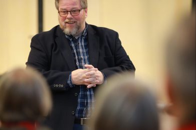
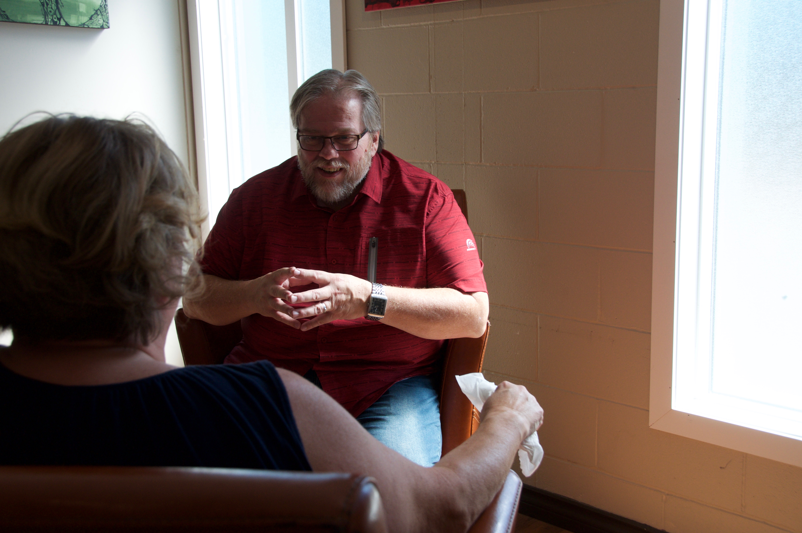

## Relationship Catalyst

I am a Relationship Catalyst who Empowers people to develop healthy relationships through inspirational speaking and transformational workshops! I have seen hundreds of lives transformed with the principals I teach.

Book Now [BUY THE BOOK](http://www.markgordon.ca/relationship-matters/) Would You Like Stronger Relationships? Discover How In Just 3 Minutes. [Take the Test Now](https://www.markgordon.ca/blind-spot-assessment/)

**"I am passionate about helping people enjoy healthy and trusting relationships."**

The cost of broken relationships is undermining the health and function of families and organizations alike. For healthy relationships to happen people need to heal from the inside out. Once healed life guiding principles and values are required to put riverbanks around the relationship which protects their heart. Healthy relationships creates a healthy culture within the family or organization. Mark is committed to empowering relationships through teaching those principles and developing tools that provide skills needed for success. Simply stated, his Mission is to “empower people in developing healthy relationships... with God, at home and at work.”

## How to Engage Mark

### Key Note  
Speaker  

Mark delivers inspiring and contextual content through his Keynote sessions. He is engaging and always leaves a group with practical life applications. His topics are relevant and empowering.

Mark is a sought after speaker for events because of his ability to connect with the listeners at a heart level. 

Book Now 

### Workshop Facilitator  

Mark offers a wide variety of workshops including Anger Management, Strength Based Parenting, Developing a Healthy Relational Culture, Strength Based Leadership, and many others. 

He also can custom design workshops for organizations to address specific relational struggles within teams.

[Register Now](http://www.markgordon.ca/contact/) 

### Relationship & Leadership Coaching

If you find your family or organization in a relational crisis. Mark will help you get to the root of the issue so healing can begin. Then he will walk with you in the journey to wholeness in your relationship.  

Mark encourages you to invest in learning the skills to improve your personal or professional relationships. 

Book Now [Get your Copy Of the Relationship Matters Book](http://www.markgordon.ca/relationship-matters/)

#### What People Say?

"Mark Gordon has three traits you look for in an exceptional relationship coach: First is "passion". I don't know anyone more passionately obsessed with healthy relationships. The second is "skill". I've seen Mark work first-hand with people, couples, families, and in professional environments where he puts his skills on display. He's funny, to the point, helpful, and engaging. And third, Mark is clearly "gifted" at helping people get better and be better. Sometimes passion and skill are not enough, but we need someone with exceptional insight into our situation. Whether a relationship at home or in business is strained, broken, unfulfilling, or lacks productivity, Mark can help. Mark has an uncanny ability to see what's going on beneath the surface and bring up and draw out practical solutions that we can apply immediately. He is never condescending, always respectful, very honoring, and relentlessly loving and hopeful. I highly recommend Mark and trust him with my own family." Gary ChupikOwner at Gary Chupik Leadership LLC "In a 2nd marriage with seven children between us, we wanted solid advice and tested principles we could use to transform our own relationship when it was on the brink of hopeless disaster! Somehow Mark’s advice and stories cut through the rhetoric and gave us both insight to build a new life on. We loved each other, we just didn’t know about how important those pillars were! Highly recommend him and his book, it has improved our lives and love!" Sue StylesBusiness Consultant for Solopreneurs / Entrepreneurs, Speaker & Author "Mark is a valued life coach and mentor. His insights and applications come out of his personal experiences, not just words alone. He has lived what he speaks. Mark has the ability to communicate truth with passion and compassion. I endorse Mark Gordon." Wes JonatOwner - Sun Valley Pools & Spas "I have had the pleasure in engaging Mark as a facilitator on many occasions and his ability to connect and communicate with a varied audience is a gift. He consistently receives the highest ratings in evaluations and feedback from the participants. Mark has the ability to take the difficult topics and issues people face and bring sensibility and solutions that can be acted on immediately. Mark wraps all his sessions around respect, honour and trust to each individual regardless of where they presently find themselves in life." Ron SchlittLead Strengths Facilitator Previous Next
