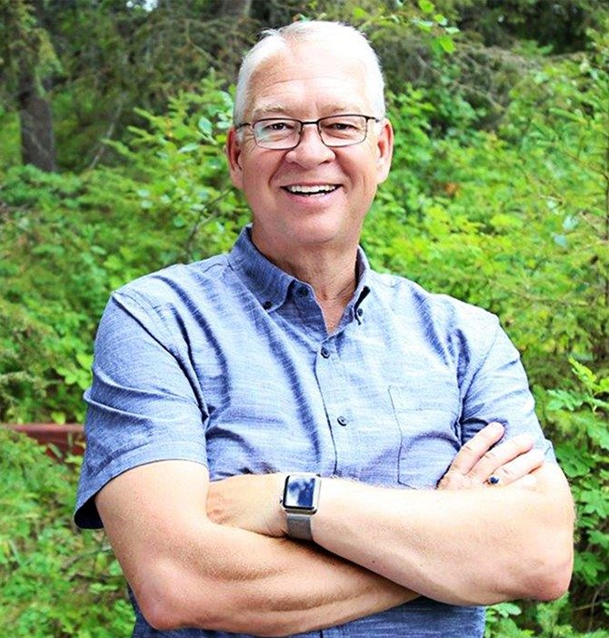

# RELATIONSHIP CHALLENGE

### Everything flows out of relationship and for relationships to be healthy they require investment! This four week masterclass will be a great investment for your marriage for just $99!

https://youtu.be/eorrAi4aoQY REGISTER NOW! [BUY THE BOOK!](https://www.markgordon.ca/relationship-matters/) 

## In this 4 week masterclass...

We will be focusing on building a healthy home:

- **A Healthy Foundation** - There are 5 pillars or principals, when lived out, create a foundation that will hold up the weight of family relationships
- **A Strong Framework** \- This is the activities that pull us together, the agreements that have us linking arms and growing together, rather then drifting apart
- **A Sturdy Roof** \- This is the covering that protects our relationship from harm, it looks at how authority works for you and how understanding your roles can bring harmony

### What's included?

#### The Relationship Blueprint

This challenge is based on the first section of my book Relationship Matters which is an essential blueprint for building a strong family and fostering healthy relationships. Get started

### Want a Flourishing Relationship?

 This investment is well worth your time and for this launch I am offering it for only $99.00! I am so excited to invest in your relationship - Let do this together - just register right here below - as a bonus to ensure you get the most out of this class, there will be weekly challenges to deepen your connection, and I am going to record each session and provide it to you after the class is complete, just in case you miss one or want to review! Register Now 

#### What People Say About Mark

## Testimonials

In a 2nd marriage with seven children between us, we wanted solid advice and tested principles we could use to transform our own relationship when it was on the brink of hopeless disaster! Somehow Mark’s advice and stories cut through the rhetoric and gave us both insights to build a new life on. We loved each other; we just didn’t know about how important it was to have a blueprint to keep us working on our relationship intentionally! Highly recommend, it has improved our lives and love! Sue StylesC.E.O. The Successful Solopreneurs School of Business Author, Business Coach, Professional Speaker The Successful Solopreneurs Podcast Host  “Mark has a remarkable capacity to connect with people. His skill as a Coach is exemplary. He is able to see through surface issues, and speak to the hear, seeing and providing wisdom that brings understanding, and steps to achieve what is desired and needed.” Jack TothFounder/V.P. External and Community Relations at Impact Society.  At his core -- Mark Gordon is a people person - and out of his heart for people, comes a desire to see people in healthy and meaningful relationships. If you are looking for a relationship coach - whether personally or professionally, I know that Marks skills and insights will provide you will tools to strengthens your relationships. Wes MillsPresident at Apostolic Church of Pentecost of Canada 
