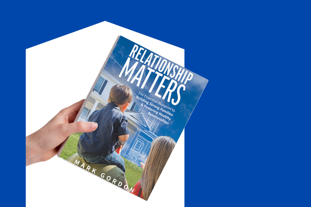
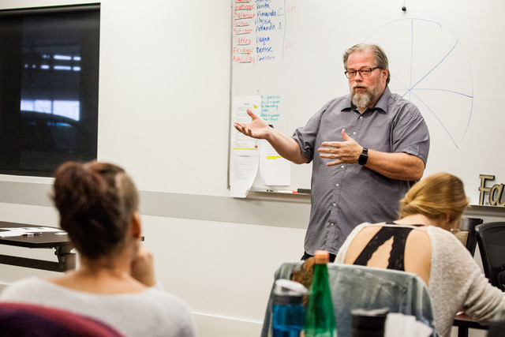
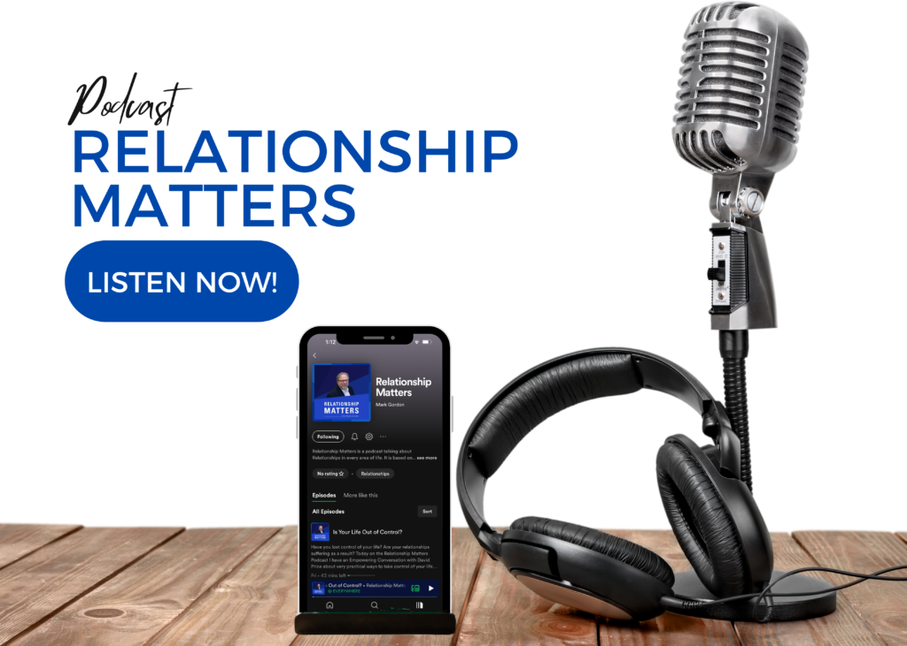

## Empowering All Your Relationships

Relationships are in crisis, that’s why I love to empower people in developing healthy relationships. I do this through transformational Courses and creating content that gives you the tools needed to succeed. People’s lives have been transformed by using the principles taught in my courses, book and keynotes.

[Book Discovery Call](https://meetings.hubspot.com/rmarkgordon/15-min-discovery-meeting) [BUY THE BOOK](http://www.markgordon.ca/relationship-matters/) Would you like stronger relationships?  
Discover how in three minutes by knowing your blindspots [Take the Free Test Now](https://www.markgordon.ca/blind-spot-assessment/)

**"**I am passionate about you enjoying healthy and trusting relationships.**"**

Today is filled with damaged relationships both personally and professionally, this epidemic continues to destroy families and erode the personal value people need to experience a flourishing life. For healthy relationships to happen people need to heal from the inside out. 

**That’s where I come in!**

I am committed to empowering all your relationships through a coaching process and teaching principles with the tools that provide skills needed for success. Simply stated, my mission is to “empower people in developing healthy relationships. . . with God, with themselves, and others, thereby, creating a healthy relational culture at home and at work.”

##### The results are…

- Happy and Healthy Relationships at home and at work
- A flourishing environment people want to be a part of
- More productive life at home and at work, with a lot less stress
- Live with confidence and authentic connections
- People who treat each other with kindness and respect

[Book Discovery Call](https://meetings.hubspot.com/rmarkgordon/15-min-discovery-meeting)

## COURSES with IMpact

### Relationship Matters

5 Pillars for a Healthy Foundation in ALL Your Relationships  
Based on my groundbreaking book Relationship Matters, this course is a powerful journey to relational healing. $ 79 In this video series you will learn

- How to build **trust** equity
- How to have healthy **communication**
- How to live **authentically**
- How **honesty** is a superpower
- How to reclaim the lost art of **honour**

[Learn More](/courses/relationship-matters/) This course has been life changing for the people who have taken it in person and now for the first time it is available in video so you can take your family, small group or organization on the journey to healthy relationships together. Popular

### Godfidence

Building Confidence That Lasts Forever  
Have you ever wished you had more confidence? Life can be a hard task master and can wear you down, including your self-esteem and confidence. $ 29 In this video series you will learn

- Where **confidence** comes from
- How **faith** can change the way you see yourself
- How **shame** destroys identity and erodes confidence
- How to **build** confidence that lasts forever!

[Learn More](/courses/godfidence-building-confidence-that-lasts-forever/) In this course, I take you on that journey of discovery. We will explore where your value comes from, and who determines it. We will also look at how shame affects your identity and ultimately your confidence negatively. I will provide you with tools to build confidence that lasts forever. Mini-Series

## More Courses . . .

Understanding Anger Punching Shame in the Face Understanding Anger

**Are you tired of being angry all the time?**

Anger can cause a lot of damage in your relationships, in fact many people who experience anger; face lost relationships, lost jobs and careers and at times, lost freedom because they even get in trouble with authorities. There is nothing wrong with anger itself, in fact it is an early warning system that lets you know trouble is ahead or that your needs are not being met. It is what you do with anger that makes it good or bad. When anger manages you rather than you managing it, it becomes destructive. In this two part video series, about 3 hours of training, I take you through the cause and effect of anger. Why you struggle with it and how to manage it and even turn it into an advantage for you. This short course has been an awakening for many people I have taught it too. Now it is available by video in the privacy of your own home. 

[Get Started Now!](/courses/understanding-anger/) 

Punching Shame in the Face

**Has shame kept you from being content in life?**

For many people shame is a pervasive force that destroys self-worth and overrides or overshadows happiness and contentment. It sabotages relationships and undermines your ability to believe in yourself or others. Shame starts from a very young age and sets out to destroy your identity and confidence. Like any bully it needs to be stood up too. In this two video series (About 3 hours of training) I go deep into the cause of shame and how to overcome it and keep it out of your life forever. There are practical tools to give you the skills to punch it right in the face. This is an emotional journey for those who have taken this course but I have been told over and over it is life changing. It is now available in video format so you can watch it in the privacy of your own home.

[Get Started Now!](/courses/punching-shame-in-the-face/)

### Relationship Matters Book

The Essential Blueprint to Building Strong Families & Fostering Healthy Relationships

**Are you at a loss to understand how your marriage has become so miserable, or do you wonder why your children are completely out of control?**

**Relationship Matters** is designed to help you and your family figure out what went wrong and to help create a healthy relational culture at home.

[Get The Book](/relationship-matters/) 

### Keynote Speaker  

Empowering Content Delivered with Passion and Practical Application 

Whether speaking in the faith community or a business, recovery agency or a non-profit or a leadership team, my goal is to be engaging and to always leave people with inspiration and practical life applications. My topics are relevant and empowering concerning relationships or the subjects that hurt or enhance them.

[Book Discovery Call](https://meetings.hubspot.com/rmarkgordon/15-min-discovery-meeting) [Learn More](/keynote-speaker/) 

### Relationship & Leadership Coaching

If you find your family or organization in a relational crisis, I will help you get to the root of the issue so healing can begin. Then I will walk with you in the journey to wholeness in your relationship.  

I encourage you to invest in learning the skills to improve your personal or professional relationships. 

[Book Discovery Call](https://meetings.hubspot.com/rmarkgordon/15-min-discovery-meeting) [Learn More](/relationship-leadership-coaching/)

#### Subscribe to My Newsletter

##### We send out weekly newsletters with relationship tips, news on upcoming events and the latest courses. 

#### What People Say?

"Mark Gordon has three traits you look for in an exceptional relationship coach: First is "passion". I don't know anyone more passionately obsessed with healthy relationships. The second is "skill". I've seen Mark work first-hand with people, couples, families, and in professional environments where he puts his skills on display. He's funny, to the point, helpful, and engaging. And third, Mark is clearly "gifted" at helping people get better and be better. Sometimes passion and skill are not enough, but we need someone with exceptional insight into our situation. Whether a relationship at home or in business is strained, broken, unfulfilling, or lacks productivity, Mark can help. Mark has an uncanny ability to see what's going on beneath the surface and bring up and draw out practical solutions that we can apply immediately. He is never condescending, always respectful, very honoring, and relentlessly loving and hopeful. I highly recommend Mark and trust him with my own family." Gary ChupikOwner at Gary Chupik Leadership LLC "In a 2nd marriage with seven children between us, we wanted solid advice and tested principles we could use to transform our own relationship when it was on the brink of hopeless disaster! Somehow Mark’s advice and stories cut through the rhetoric and gave us both insight to build a new life on. We loved each other, we just didn’t know about how important those pillars were! Highly recommend him and his book, it has improved our lives and love!" Sue StylesBusiness Consultant for Solopreneurs / Entrepreneurs, Speaker & Author "Mark is a valued life coach and mentor. His insights and applications come out of his personal experiences, not just words alone. He has lived what he speaks. Mark has the ability to communicate truth with passion and compassion. I endorse Mark Gordon." Wes JonatOwner - Sun Valley Pools & Spas "I have had the pleasure in engaging Mark as a facilitator on many occasions and his ability to connect and communicate with a varied audience is a gift. He consistently receives the highest ratings in evaluations and feedback from the participants. Mark has the ability to take the difficult topics and issues people face and bring sensibility and solutions that can be acted on immediately. Mark wraps all his sessions around respect, honour and trust to each individual regardless of where they presently find themselves in life." Ron SchlittLead Strengths Facilitator Previous Next
