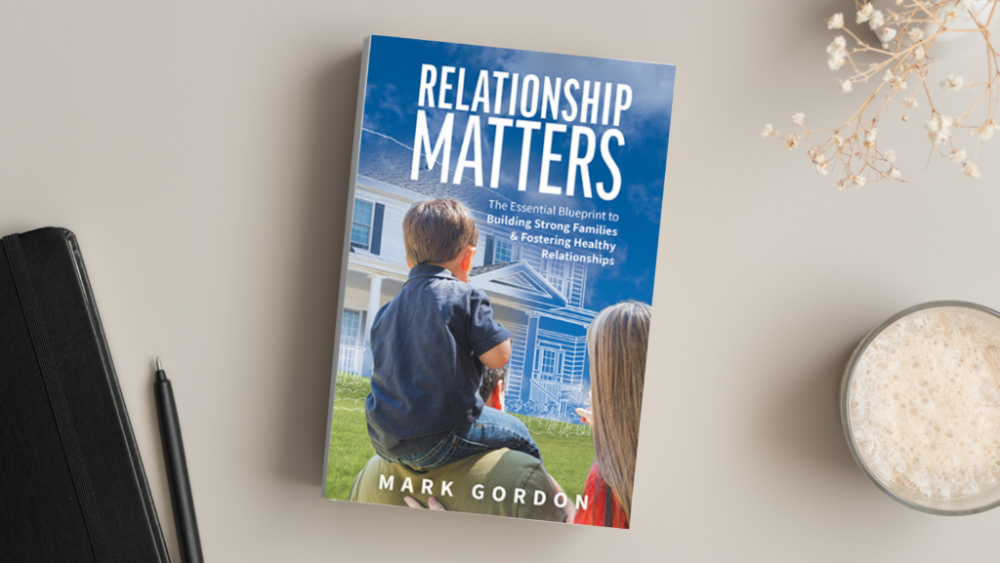

# Relationship Matters

#### The Essential Blueprint to  
**Building Strong Families & Fostering Healthy Relationships**

## BUY NOW!

Available at all of your favourite booksellers by clicking on the links below:

## [FRIESENPRESS BOOKSTORE](https://books.friesenpress.com/store/title/119734000135991162/Mark-Gordon-Relationship-Matters)

## [GOOGLE  
PLAY](https://play.google.com/store/books/details/Mark_Gordon_Relationship_Matters?id=TYkfEAAAQBAJ)

## [APPLE  
BOOKS](https://books.apple.com/ca/book/relationship-matters/id1555575810?ign-gact=1)

## [AMAZON.COM  
USA](https://www.amazon.com/Relationship-Matters-Essential-Fostering-Relationships/dp/1525574361)

## [AMAZON.CA  
CANADA](https://www.amazon.ca/Relationship-Matters-Essential-Fostering-Relationships/dp/1525574353)

## [KINDLE  
EBOOKS](https://www.amazon.ca/dp/B08X71B1XC?ref=KC_GS_GB_CA)

## Are you at a loss to understand how your marriage has become so miserable, or do you wonder why your children are completely out of control?

Relationship Matters is designed to help you and your family figure out what went wrong and to help create a healthy relational culture at home. Based on the metaphor of constructing a strong house, the content is presented in three sections.

- **Building a Healthy Foundation** discusses the five fundamental pillars of a healthy relationship.
- **Building a Strong Framework** teaches how to motivate family members, so they each flow in a common or shared direction.
- **Building a Sturdy Roof** introduces relational protection through fostering an understanding of authority and family roles.

Relationship Matters offers insight into your family dynamics and ways to improve them. Learn how to build trust equity. Build authentic relationships. Create a healthy family culture.

[Book Discovery Call](https://meetings.hubspot.com/rmarkgordon/15-min-discovery-meeting)

### "

Relationship Matters is a timely invitation and inspiring guide for what it means to live an empowered and purposeful life in relationship with others. In an insightful and practical way, Mark has outlined 5 critical pillars that provide a roadmap and strategic action plan for individuals wanting to create a family environment that is transformational in the way it supports its members to become healthy, content, competent and flourishing adults.

### Dr. Wayne Hammond

### Founding Partner and CSO Flourishing Life Adjunct Professor at Ambrose University
